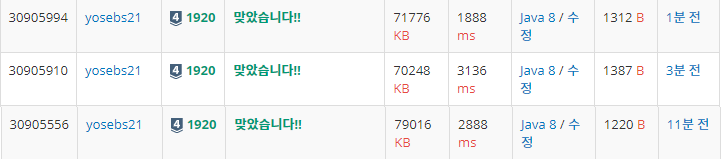

```
package study.July.BinarySearch;

import java.io.BufferedReader;
import java.io.IOException;
import java.io.InputStreamReader;
import java.util.Arrays;
import java.util.StringTokenizer;

public class BJ_1920_수찾기 {
	public static void main(String[] args) throws NumberFormatException, IOException {
		BufferedReader br = new BufferedReader(new InputStreamReader(System.in));
		int N = Integer.valueOf(br.readLine());
		StringTokenizer st = new StringTokenizer(br.readLine());
		int arr[] = new int[N];
		for(int i = 0; i < N; i++) {
			arr[i] = Integer.valueOf(st.nextToken());
		}
		Arrays.sort(arr);
		int M = Integer.valueOf(br.readLine());
		st = new StringTokenizer(br.readLine());
		int left = 0;
		int right = N;
		for(int i = 0; i < M; i++) {
			int cur = Integer.valueOf(st.nextToken());
			int result = binarySearch(arr,left,right,cur);
			System.out.println(result);
		}
	}

	private static int binarySearch(int[] arr, int from, int to, int num) {
		int left = from;
		int right = to - 1;
		while(left <= right) {
			int midIndex = (left + right) / 2;
			int midValue = arr[midIndex];
			if(midValue > num) {
				right = midIndex - 1;
			}
			else if (midValue < num) {
				left = midIndex + 1;
			}
			else {
				return 1;
			}
		}
		return 0;
	}

}

```
배열로 한 코드

```
import java.io.BufferedReader;
import java.io.IOException;
import java.io.InputStreamReader;
import java.util.ArrayList;
import java.util.Collections;
import java.util.StringTokenizer;

public class Main {
	static int M;
	static ArrayList<Integer> l = new ArrayList<Integer>();
	public static void main(String[] args) throws NumberFormatException, IOException {
		BufferedReader br = new BufferedReader(new InputStreamReader(System.in));
		int N = Integer.valueOf(br.readLine());
		StringTokenizer st = new StringTokenizer(br.readLine());
		for(int i = 0; i < N; i++) {
			l.add(Integer.valueOf(st.nextToken()));
		}
		Collections.sort(l);
		M = Integer.valueOf(br.readLine());
		st = new StringTokenizer(br.readLine());
		int size = l.size();
		for(int i = 0; i < M; i++) {
			int cur = Integer.valueOf(st.nextToken());
			int result = binarySearch(0,N,cur);
			System.out.println(result);
		}
	}

	private static int binarySearch(int from,int to, int target) {
		int left = from;
        int right = to - 1;
		while(left <= right){
            int midIndex = (left+right)/2;
            int midValue = l.get(midIndex);
            if(midValue > target){
                right = midIndex-1;
            }
            else if(midValue < target){
                left = midIndex+1;
            }
            else{
                return 1;
            }
        }
        return 0;
	}

}

```
ArrayList + StringTokenizer
```
import java.io.BufferedReader;
import java.io.IOException;
import java.io.InputStreamReader;
import java.util.ArrayList;
import java.util.Collections;

public class Main {
	static int M;
	static ArrayList<Integer> l = new ArrayList<Integer>();
	public static void main(String[] args) throws NumberFormatException, IOException {
		BufferedReader br = new BufferedReader(new InputStreamReader(System.in));
		int N = Integer.valueOf(br.readLine());
		String str[] = br.readLine().split(" ");
		for(int i = 0; i < N; i++) {
			l.add(Integer.valueOf(str[i]));
		}
		Collections.sort(l);
		M = Integer.valueOf(br.readLine());
		str = br.readLine().split(" ");
		int size = l.size();
		for(int i = 0; i < M; i++) {
			int cur = Integer.valueOf(str[i]);
			int result = binarySearch(0,N,cur);
			System.out.println(result);
		}
	}

	private static int binarySearch(int from,int to, int target) {
		int left = from;
        int right = to - 1;
		while(left <= right){
            int midIndex = (left+right)/2;
            int midValue = l.get(midIndex);
            if(midValue > target){
                right = midIndex-1;
            }
            else if(midValue < target){
                left = midIndex+1;
            }
            else{
                return 1;
            }
        }
        return 0;
	}

}

```
ArrayList + str(br.readLine().split(" "))


